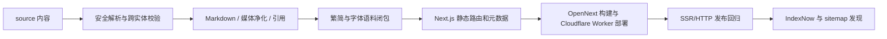

# 内容、构建与发布管线

状态：现行架构

本文说明从仓库内容到公开站点的可执行链路。字段和编辑规则以 [`delivery-standards.md`](../delivery-standards.md) 为权威，页面行为以 [`frontend-product-spec.md`](../frontend-product-spec.md) 为权威；本文只维护所有权、生成步骤、门禁、发布和回滚。

## 1. 总体链路



管线中的中间 HTML、`.next`、sitemap、RSS 和引用下载文件都是生成物。内容与路由的权威来源留在 `source/`、`lib/` 和 `app/`，不要把构建输出复制回仓库根目录作为第二份来源。

## 2. 源数据与稳定身份

| 来源 | 解析所有者 | 公开结果 |
| --- | --- | --- |
| `source/_posts/*.md` | `lib/posts.ts`、`lib/markdown.ts` | 普通文章或多媒体详情、引用文件、RSS 项；`book_document: true` 时仅作为书籍章节构建源。 |
| `source/_books/*.json` | `lib/books.ts` | 书籍索引、详情、独立章节页面和书籍／章节引用文件。 |
| `source/_topics/*.md` | `lib/topics.ts` | 人工策展专题索引与详情。 |
| `lib/contributors.ts` | 内容校验与署名组件 | 贡献者稳定身份和文库筛选。 |
| `public/attachments/`、`public/img/` | Next.js 静态资源 | 正文图片与公开静态材料。 |

微信原始页面只在 Git 外作为编辑底本。需要生成候选 Markdown 时运行：

```bash
npm run convert:wechat -- SOURCE_DIR OUTPUT_PREFIX [ASSET_BASE]
```

转换器只映射 HTML 中明确存在的标题、段落、引文、列表、表格、强调、链接、图片和媒体节点；不判断作者职责，不删除推广或二维码，也不凭字号、边框和措辞猜测标题、图题或正文价值。无法直接表达的媒体会留下待处理标记和本地 IR 诊断，`validate:content` 会阻止该标记进入公开稿。编辑仍须完整阅读原页面，决定署名、删留、语义层级、系列关系和最终版式；IR 是临时诊断，不是提交所需的保全账簿。

完成正文删留后，用同一源目录把最终 Markdown 实际采用的图片登记到公开资产合同；命令只复制抓取清单中已有的文件信息，不选择图片、不上传整批库存：

```bash
npm run assets:wechat:register -- SOURCE_DIR FINAL_MARKDOWN
```

- 文章和书籍使用显式 ASCII slug；专题以稳定 ASCII slug 为身份，省略 front matter `slug` 时由 ASCII 文件名提供默认值。
- `section`、分类、标签、贡献者和专题是不同维度，不能互相推导替代。
- 已发布书籍章节生成独立 canonical 和 sitemap 项；构建期按 manifest anchor 切分 Markdown，并只附带本章引用的注释。书籍构建源不生成 `/posts/` 页面。
- 书籍 manifest 的每个章节节点可以声明独立 `tags` 字符串数组；未声明或为空时继承对应 `book_document` Markdown 的 front matter 标签。章节标签必须非空且去重。
- 章节 `presentation` 区分正文、附属材料与纯导航节点，但首页和文库都把同一本书折叠为一个 `/books/<slug>` 连载条目。独立章节 URL 继承书籍条目的全站号与栏目号，不再各自占号。
- 同一父章标题下的连续分篇不进入 manifest 递归章节节点，而记录在父章 `sections` 元数据中：父章 anchor 仍是切分边界，已发布分篇以正文内稳定 `h3` 存在，由渲染标题数据生成 hash 导航；待更新分篇不得提前进入正文。只有确实需要独立 canonical 的章节才增加 chapter／children 节点。
- 内容日期驱动 metadata、sitemap `lastmod` 和 RSS；IndexNow 由公开内容源文件的路径变更触发。构建时间不能伪装为内容更新时间。

## 3. 解析、安全与渲染

内容加载器先解析受支持的标准或历史 front matter，再进行类型、日期、唯一性和跨实体引用校验。Markdown 管线负责：

- 方向性引号和排版规范化；
- GFM 表格、脚注、KaTeX 与标题 ID；
- 站内附件路径改写；
- 外链属性和危险协议过滤；
- 注释／文献拆分所需的稳定结构；
- 罕见汉字包装和媒体指纹。

多媒体条目的资料 HTML 使用独立允许列表。播放器、脚本、事件属性、主动内容和危险 URL 必须在进入 React 输出前被剔除。

引用数据使用 Zotero item JSON 语义。构建时统一生成 BibTeX 复制内容、`/cite.bib` 下载路由、页面 metadata 和 JSON-LD；没有核验的字段保持为空，不为通过界面或测试而猜填。

## 4. 繁简与字体闭包

`npm run fonts:sync` 是开发、检查、构建和部署共享的幂等字体入口。中文生成器读取 `app/`、`lib/`、`source/` 及 `public/llms.txt`，计算源字符和 OpenCC 双向转换后的并集；日文生成器读取日文译稿、语言状态卡及本地化组件。英文使用 Next 内置的固定 `latin / latin-ext` 自托管构建，不维护语料指纹。`public/fonts/cjk-font-manifest.json` 固定：

- 语料文件数和字符摘要；
- OpenCC 闭包策略；
- 字体源版本；
- 每个 WOFF2 的字节数和字符数；
- 三款源字体共同不支持的字符范围。

同步器只在目标字符集合、字体源版本、生成策略或锁定工具链变化时重建 WOFF2。仅改写已有字符的正文时，最多在共享锁内刷新输入清单，不重编字体；无锁快速检查始终只读。中文和日文字体源都固定到具体上游版本并下载到 Git 外缓存。真实重编会自动进入 `.local-archive/` 下按 requirements 版本隔离的私有虚拟环境，不读取或修改全局 Conda。正常流程无需手工准备源字体、安装 FontTools 或更新 CSS：

```bash
npm run fonts:sync
npm run verify:fonts
```

生成器分别写入 `app/cjk-fonts.generated.css` 与 `app/translation-fonts.generated.css`，不修改手写样式。源字体文件名、依赖与 rare Han fallback 见 [`public/fonts/README.md`](../../public/fonts/README.md)。

## 5. 路由与生成物

Next.js App Router 从 `app/` 生成：

- 首页、About、文库、书籍和专题聚合页；
- 文章、多媒体、书籍和专题详情；
- 独立书籍章节与文章／书籍／章节 BibTeX route handler；
- `/robots.txt`、`/sitemap.xml` 和 `/rss.xml`。

动态公开实体使用 `generateStaticParams` 与 `dynamicParams = false` 固定发布集合。旧 `/search` 保留为 `/library` 的兼容重定向；未知实体不能在运行时悄悄变成动态页面。

根目录 `sitemap.xml` 不是来源，也不是受管理构建产物。唯一来源是 `app/sitemap.ts`，构建后由 Next.js 提供 `/sitemap.xml`。

## 6. 门禁分层

`package.json` 是命令清单的唯一执行来源。文档解释覆盖范围，不复制一条容易漂移的脚本链。

| 层级 | 命令 | 能证明什么 | 不能证明什么 |
| --- | --- | --- | --- |
| 确定性静态与逻辑 | `npm run check` | 内容、净化、排版、字体、阅读记录、繁简、引用、依赖、静态路由、TypeScript、ESLint。 | React hydration、真实浏览器交互和视觉终态。 |
| 生产构建 | `npm run build` | Next.js 编译、SSG、路由和资源可生成。 | 部署环境和客户端体验。 |
| SSR／HTTP 发布回归 | `npm run verify:release -- <base-url>` | 导航、筛选、HTML、metadata、canonical、重定向、JSON-LD、sitemap、RSS 和字体资源。 | 客户端 JS、焦点、localStorage、WebKit、动效和真实行盒。 |
| 浏览器交互 | 博客自有 Playwright specs；状态与矩阵见 [`testing.md`](../testing.md) | 本地生产构建的真实 hydration、localStorage、焦点、剪贴板反馈和引擎差异。 | `implemented` 不表示最近一次远端结果；也不证明 Cloudflare Worker 部署、真实设备、完整视觉或辅助技术体验。 |

`verify:editorial` 是历史兼容别名；新文档和新流程统一使用 `verify:release`。

## 7. 本地可重复验证

使用锁文件安装依赖并完成静态门禁与构建：

```bash
npm ci
npm run check
npm run build
```

随后在终端 A 启动并保持生产服务运行：

```bash
npm run start -- --hostname 127.0.0.1 --port 3100
```

在终端 B 执行发布回归；结束后回到终端 A 停止服务：

```bash
npm run verify:release -- http://127.0.0.1:3100
```

构建会把最新修改时间写入页面；需要比较两个候选构建时，应显式固定：

```bash
ROOF_BUILD_TIMESTAMP=2026-07-25T21:44:45.000Z npm run build
```

PowerShell 使用 `$env:ROOF_BUILD_TIMESTAMP='...'` 后再运行构建。固定该值只用于可比较证据，不得替代真实部署时间记录。

## 8. CI 与 Cloudflare Worker

`.github/workflows/quality.yml` 在所有 pull request 和 `main` push 上执行：

1. `npm ci`
2. `npm run check`
3. `npm run build`
4. 启动本地生产服务
5. `npm run verify:release`

GitHub Quality 与 IndexNow runner 固定为 `ubuntu-24.04` 和 Node `22.20.0`，官方 Actions 固定到已核验的完整提交 SHA。`.github/workflows/browser-smoke.yml` 调用公开的 `UCCTB/web-test-platform` reusable workflow，并固定其完整提交 SHA；workflow 不声明或继承调用方配置的 repository／organization secrets，GitHub 自动提供的 caller `GITHUB_TOKEN` 只授予 `contents: read`，artifact 属于博客 caller run。Playwright 版本、项目矩阵、产品断言和测试素材由博客自己的 lockfile、配置与 specs 持有，完整权责和 SHA 更新流程见 [`testing.md`](../testing.md)。

`scripts/deploy-cloudflare.mjs` 是现行部署入口。preview 分为两个原生 Cloudflare 阶段：
`cf:upload:preview` 从未提交工作区构建，复用本地 Next 构建缓存，并通过 Worker Versions 上传一个不承载固定域名
流量的候选；`cf:promote:preview -- <VERSION_ID>` 只把已验收的同一版本提升到固定预览域名，不重建或重传。
production 则由 `cf:deploy:production` 同步字体、检查干净提交、从当前提交建立隔离构建根、执行 OpenNext
构建、裁掉 R2 已承载的重复附件后部署。预览构建的 Next Build ID 固定为其工作区基准提交，因此同一未提交稿
的内容反馈不会为全部 OpenNext cache 文件制造新命名空间；构建时间只进入 `/about` metadata，不再污染每个
静态路由。上传或部署成功只说明 Worker 接受了候选；运行时验收还必须记录提交 SHA 或候选基准、构建时间、
Worker Version ID 和目标 URL，并对版本 URL或提升后的公开别名执行 `verify:release`。当前没有对线上 Worker
自动执行 Playwright；不得把本地 browser suite 写成部署后浏览器冒烟。

## 9. 发布发现

- `app/sitemap.ts` 和 RSS 使用内容源中的真实日期。
- `.github/workflows/indexnow.yml` 只在 `main` 上文章、书籍或专题源发生变化时运行。
- IndexNow 先轮询生产内容可访问，再提交实体 URL 和相应聚合页。
- 当前工作流只处理新增、修改和重命名后的新路径；删除或重命名前的旧 URL 不会主动提交，而是等待抓取后自然去索引。
- Google 不使用 IndexNow，依赖 sitemap `lastmod` 重抓。

IndexNow 是发现流程，不是质量门禁；它看见 2xx／3xx 不代表页面行为已经验收。

## 10. 发布失败与回滚

1. 保留失败的提交 SHA、构建日志、Worker 版本 ID 和验证输出。
2. 若只影响尚未提升的 Version Preview，停止提升并前向修复；固定预览域名不受影响。
3. 若已经影响生产，优先在新提交中修复；需要回退时对引入问题的提交使用 `git revert`，再通过 Cloudflare production 部署入口发布。
4. 回滚后重新执行正式域名 `verify:release` 和受影响浏览器场景。
5. sitemap、RSS 或 IndexNow 错误应修正其源码生成器，不能手工维护根目录副本掩盖问题。

仓库当前状态为 `implemented` 的浏览器资产包括 Desktop Chromium Reader smoke、移动 Chromium／WebKit、跨标签页、dialog 焦点和 BibTeX 剪贴板 specs；其精确覆盖与 `planned / manual / not-covered` 边界见 [`testing.md`](../testing.md)。资产存在不表示任一分支最近一次执行成功。Reusable workflow 产生的报告与失败 trace／截图保留在博客 caller artifact，不向 UCCTB 回写；正式域名自动浏览器回归仍为 `not-covered`。
